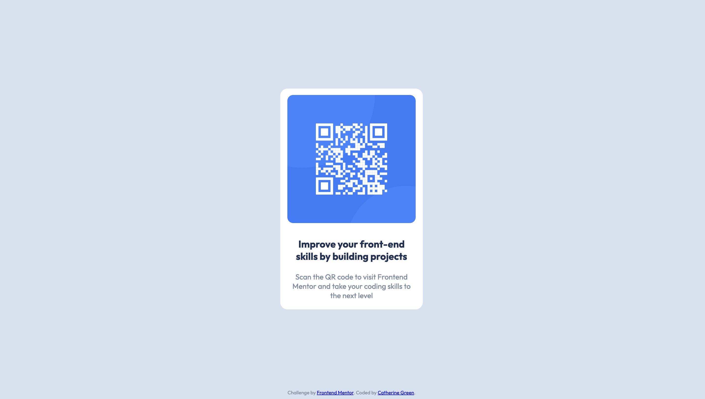

# Frontend Mentor - QR code component solution

This is a solution to the [QR code component challenge on Frontend Mentor](https://www.frontendmentor.io/challenges/qr-code-component-iux_sIO_H). Frontend Mentor challenges help you improve your coding skills by building realistic projects. 

## Table of contents

- [Overview](#overview)
  - [Screenshot](#screenshot)
  - [Links](#links)
- [My process](#my-process)
  - [Built with](#built-with)
  - [What I learned](#what-i-learned)
  - [Continued development](#continued-development)
  - [Useful resources](#useful-resources)
- [Author](#author)
- [Acknowledgments](#acknowledgments)

## Overview

### Screenshot




### Links

- Solution URL: [Add solution URL here](https://your-solution-url.com)
- Live Site URL: [Add live site URL here](https://your-live-site-url.com)

## My process

### Built with

- Semantic HTML5 markup
- CSS custom properties
- Flexbox

### What I learned

I chose to use HMTL 5 and CSS to complete this challenge. I enjoyed playing with Flexbox to move the QR Card to the middle of the page.

Things to remember for next time:
```css
body {
min-height: 100vh;
  width: 100%;
  }
```
This allowed me to make the body element the full desktop size and move the section element into the middle.

I used the design outlines to create CSS variables:

```css
:root {
  --White: hsl(0, 0%, 100%);
  --Light-gray: hsl(212, 45%, 89%);
  --Grayish-blue: hsl(220, 15%, 55%);
  --Dark-blue: hsl(218, 44%, 22%);
  --font: "Outfit", sans-serif;
}
```

### Continued development

There are many areas of CSS I am not 100% secure on, and look forward to trying some more Frontend Mentor challenges to see how I get on!

### Useful resources

- https://fonts.google.com/specimen/Outfit - google fonts
- https://www.freecodecamp.org/news/html-page-width-height/#:~:text=If%20you%20set%20the%20width,value%20and%20allowing%20the%20default - useful for adjusting the size of my body element

## Author

- Website - [Catherine Green](https://www.your-site.com)
- Frontend Mentor - [@CGreen789](https://www.frontendmentor.io/profile/CGreen789)
- Twitter - [@catherineg489](https://www.twitter.com/catherineg478)

## Acknowledgments

I completed this during Week 8 of The School of Code's course. Thanks to Keelie for helping me with this one!

